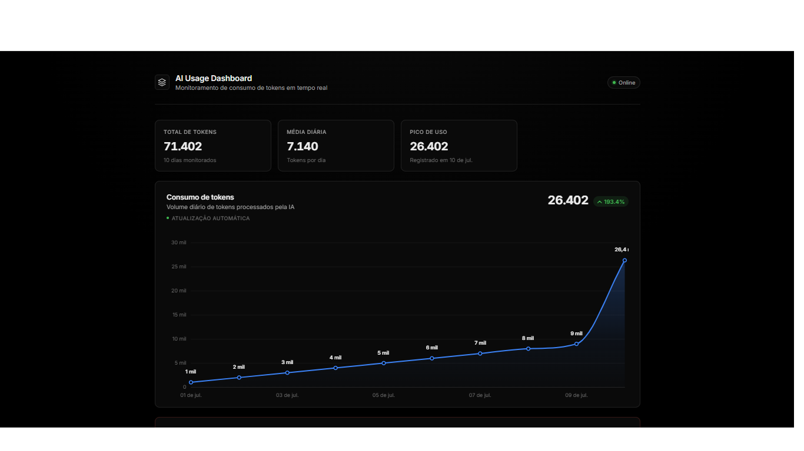

# AI Proxy API

A middleware and proxy API designed to securely manage, route, and monitor requests to official Artificial Intelligence APIs, providing centralized access, usage tracking, and a built-in analytics dashboard.

## Dashboard Preview



## Getting Started

Clone the repository:

```bash
git clone https://github.com/victor-augusto-developer/Api-IA.git
```

Go to the project folder:

```bash
cd Api-IA
```

Install the dependencies:

```bash
npm install
```

Start the server:

```bash
npm start
```